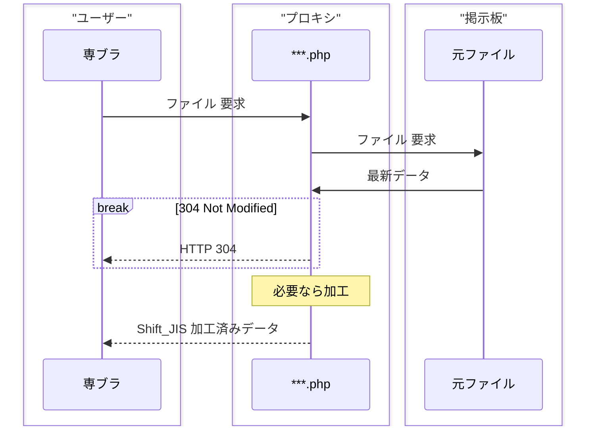
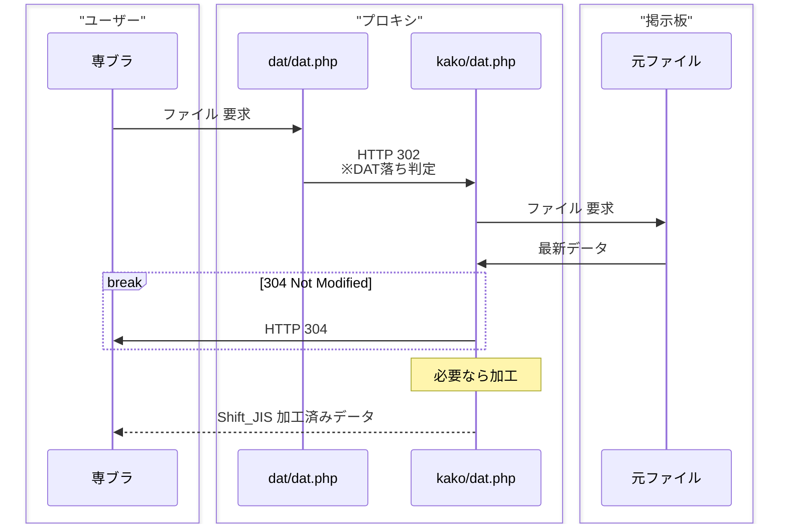
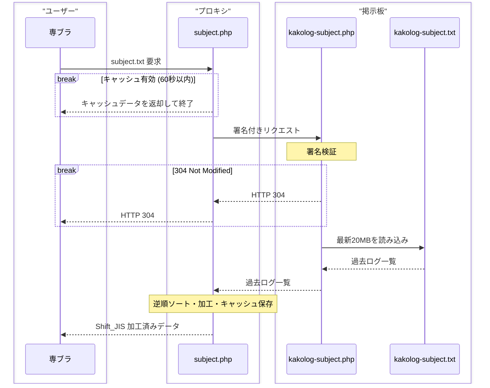

# このスクリプトについて

## 概要

このスクリプトは[delightly-v2fork](https://github.com/konkon-fox/delightly-v2fork)の拡張スクリプトです。  
別のドメイン(サブドメイン等)に設置し、専ブラ用の過去ログ板として機能するプロキシ機能を持ちます。

解説の簡便化のために以降は以下の呼称を使います。

- [delightly-v2fork](https://github.com/konkon-fox/delightly-v2fork) **掲示板**
- 本スクリプト **プロキシ**

## 動作環境

- **PHP 8.1** で確認済み
- [delightly-v2fork](https://github.com/konkon-fox/delightly-v2fork) **v4.0.0-dev** 以上

## 設定・設置

### 掲示板側の準備

#### シークレットキーの作成

`/test/secret-key.txt` を作成し、中に自身で決めたパスワードを記入してください。  
パスワードは類推されにくい文字列にしてください。

#### .nginx.conf の設定

`.htaccess`を利用可能なサーバーの場合はこちらの項目は飛ばしてください。  
掲示板側の`/nginx.conf.example`を参考に自身の`nginx.conf`を編集してください。

### プロキシ側の準備

#### ユーザー設定

1. `/user-settings.php.template`を`/user-settings.php`にリネームしてください。
2. `/user-settings.php`の中身を編集してください。
   - **$DOMAIN**: 掲示板のドメイン(例: 'example.com')
   - **$YOUR_SECRET_KEY** : 掲示板側で設定したパスワード
   - **$excludeBbs**: 除外する板のディレクトリ名。不要なら空欄のままにしておいてください。
   - **$TARGET_SCHEME**: デフォルトは`https`です。必要に応じて `http` に変更してください。

#### .nginx.conf の設定

`.htaccess`を利用可能なサーバーの場合はこちらの項目は飛ばしてください。  
プロキシ側の`/nginx.conf.example`を参考に自身の`nginx.conf`を編集してください。

### 設置

掲示板側(例: `example.com`)とは別のドメイン(例: `kako.example.com`)の root にプロキシスクリプト一式をアップロードしてください。

## アクセス方法

掲示板側の板フォルダ名と同じパスをプロキシ側の URL で開いてください。(例: `kako.example.com/{$bbs}/`)  
スレ一覧が表示されれば成功です。

## 仕様

- このプロキシは 60 秒間のキャッシュを持ちます(`/tmp/`)。
- 取得する`subject.txt`は最新から20万件の制限があります。

## 処理フロー

### head.php, SETTING.php, index.php

### dat.php

### subject.php

### bbs.php

- 書き込み処理を拒否

### read.php

- 掲示板 URL へリダイレクト

## Lisence

The license in the LICENSE file applies, unless a separate license is listed in the source code.
